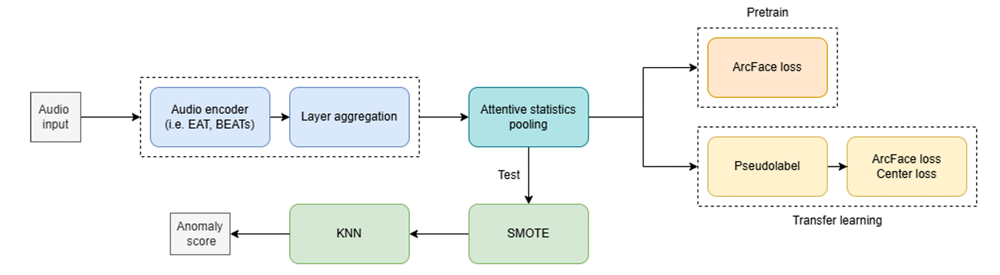

# 2025-Dcase-Task2
# DCASE 2025 Task 2  
## First-Shot Unsupervised Anomalous Sound Detection

## Overview

This project addresses **DCASE 2025 Task 2: First-Shot Unsupervised Anomalous Sound Detection**, where models must detect anomalies using only normal data under severe domain shift and limited annotations.

To tackle this, we propose a **two-stage training framework** built on **self-supervised pretrained audio transformers (EAT, BEATs)**, enhanced with **multi-layer feature aggregation** and **discriminative loss design**.

Specifically, we leverage **multi-layer aggregation** to integrate both low-level acoustic patterns and high-level Information, enabling richer and more robust audio representations. Furthermore, we incorporate **Center Loss alongside ArcFace Loss** to enforce compact intra-class distributions while increasing inter-class distance, which is critical for distance-based anomaly detection.

##  Overall Architecture

---

## Main Challenges

1. **Self-Supervised Learning Constraint**  
   - No abnormal data available during training

2. **Data Scarcity (Target Domain)**  
   - Limited 2025 data for some attribute(class)

3. **Domain Shift Problem**  
   - Training: Source : Target = 99 : 1  
   - Test : Source : Target = 1 : 1

4. **Missing Labels**  
   - Some data missed attribute information

---

## Dataset

- **Training Data**
  - DCASE 2020 ~ 2025 datasets
  - Includes multiple machine types (ToyCar, Fan, Gearbox, etc.)

- **Testing Data**
  - Only **DCASE 2025 dataset**

- **Additional Data**
  - Clean noise
  - Clean machine sounds

---

## Method

### 1. Pretrained Audio Encoder
- **EAT (Efficient Audio Transformer)**
- **BEATs**

---

### 2. Two-Stage Training Framework

####  Stage 1: Pretraining
- Dataset: 2020 ~ 2025
- Objective: Learn general machine sound representation
- Loss: **ArcFace Loss**

####  Stage 2: Transfer Learning
- Dataset: 2025 only
- Objective: Adapt to target domain
- Techniques:
  - Pseudo-labeling
  - ArcFace + Center Loss

---

### 3. Multi-Layer Aggregation
To capture both fine-grained and global audio characteristics, we aggregate representations from all transformer layers.

- Combine:
  - Low-level →  local Information
  - High-level → Global Patterns

---

### 4. Attentive Statistics Pooling
- Converts variable-length sequence → fixed embedding
- Captures both global and local temporal features

---

### 5. Loss Function Design

To optimize the embedding space for anomaly detection, we combine:

- **ArcFace Loss**
  - Enhances inter-class separability

- **Center Loss**
  - Reduces intra-class variance

Result:
- Better clustering of normal data
- Improved anomaly detection

---

### 6. Pseudo-Labeling

To utilize data without attribute labels, we apply pseudo-labeling:

1. Extract embeddings (pretrained model)
2. Apply **UMAP** for dimensionality reduction 
3. Perform clustering
4. Assign pseudo labels

This allows unlabeled data to contribute to supervised training.

---

### 7. LoRA for Efficient Fine-Tuning & Regularization

We apply **LoRA** to both transformer layers and the **Layer Aggregation MLP**, which we identified as a major parameter bottleneck (~99M parameters).

- Reduces trainable parameters  
- Prevents overfitting under limited data

---

### 9. Domain Shift Handling

- **SMOTE**
- Balances normal data distribution

---

## Key Contributions

- Two-stage training for domain adaptation
- Multi-layer feature aggregation
- Hybrid loss (ArcFace + Center Loss)
- Pseudo-labeling for missing labels
- Efficient fine-tuning via LoRA

---

## Project Structure

